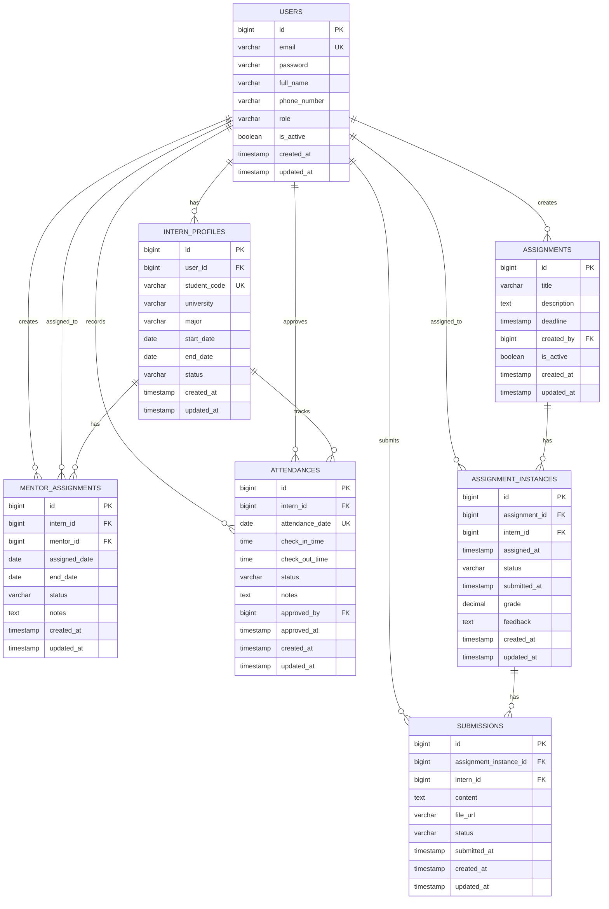
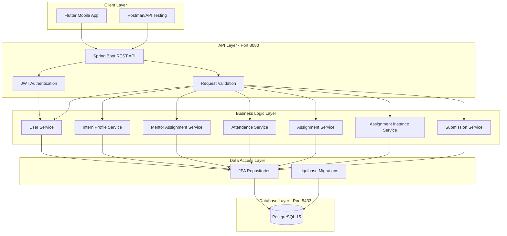

# IMES System Overview - Full Documentation

## 1. Entity Relationship Diagram (ERD)



## 2. Database Schema Details

### 2.1 Core Entities

#### **users** (Authentication & Authorization)
- **Purpose**: Central user management for all system roles
- **Roles**: ADMIN, HR, MENTOR, INTERN
- **Key Features**: 
  - Email-based authentication
  - BCrypt password hashing
  - Role-based access control
  - Soft delete with is_active flag

#### **intern_profiles** (Intern Management)
- **Purpose**: Store detailed intern information
- **Key Features**:
  - Student code uniqueness
  - University and major tracking
  - Internship period management (start_date, end_date)
  - Status tracking: ACTIVE, COMPLETED, TERMINATED

#### **mentor_assignments** (Mentor-Intern Relationships)
- **Purpose**: Track mentor-intern pairings
- **Key Features**:
  - Many-to-many relationship support
  - Assignment period tracking
  - Status: ACTIVE, COMPLETED, CANCELLED
  - Notes for additional context

#### **attendances** (Daily Attendance Tracking)
- **Purpose**: Record intern daily attendance
- **Key Features**:
  - Check-in/check-out time tracking
  - Status: PRESENT, ABSENT, LATE, HALF_DAY
  - Approval workflow (approved_by, approved_at)
  - Unique constraint on intern_id + attendance_date

### 2.2 Assignment Workflow Entities

#### **assignments** (Task Templates)
- **Purpose**: Tasks/assignments created by mentors
- **Key Features**:
  - Title, description, deadline
  - Created by mentor (created_by → users.id)
  - Soft delete with is_active
  - Can be assigned to multiple interns

#### **assignment_instances** (Task Assignments)
- **Purpose**: Specific assignment given to specific intern
- **Key Features**:
  - Links assignment to intern
  - Status: ASSIGNED, SUBMITTED, REVIEWED
  - Grade and feedback after review
  - Submission timestamp tracking

#### **submissions** (Intern Submissions)
- **Purpose**: Store intern's work submission
- **Key Features**:
  - Content and file URL storage
  - Status: DRAFT, SUBMITTED, REVIEWED
  - Timestamp tracking
  - Version control capability

## 3. System Architecture



## 4. API Endpoints Overview

### 4.1 Authentication (F1-F2)
```
POST   /api/auth/register      - Register new user
POST   /api/auth/login         - Login and get JWT token
POST   /api/auth/logout        - Logout (invalidate token)
GET    /api/auth/profile       - Get current user profile
PUT    /api/auth/profile       - Update profile
PUT    /api/auth/change-password - Change password
```

### 4.2 User Management (F3-F4)
```
GET    /api/users              - List all users (ADMIN, HR)
GET    /api/users/{id}         - Get user by ID
POST   /api/users              - Create new user (ADMIN)
PUT    /api/users/{id}         - Update user (ADMIN)
DELETE /api/users/{id}         - Delete user (ADMIN)
GET    /api/users/role/{role}  - Get users by role
```

### 4.3 Intern Profile Management (F5-F7)
```
GET    /api/intern-profiles              - List all intern profiles
GET    /api/intern-profiles/{id}         - Get profile by ID
POST   /api/intern-profiles              - Create profile
PUT    /api/intern-profiles/{id}         - Update profile
DELETE /api/intern-profiles/{id}         - Delete profile
GET    /api/intern-profiles/user/{userId} - Get by user ID
GET    /api/intern-profiles/status/{status} - Filter by status
GET    /api/intern-profiles/university/{name} - Filter by university
GET    /api/intern-profiles/active       - Get active interns
GET    /api/intern-profiles/search       - Search profiles
PUT    /api/intern-profiles/{id}/status  - Update status
```

### 4.4 Mentor Assignment (F8-F10)
```
GET    /api/mentor-assignments              - List all assignments
GET    /api/mentor-assignments/{id}         - Get by ID
POST   /api/mentor-assignments              - Create assignment
PUT    /api/mentor-assignments/{id}         - Update assignment
DELETE /api/mentor-assignments/{id}         - Delete assignment
GET    /api/mentor-assignments/mentor/{id}  - Get by mentor
GET    /api/mentor-assignments/intern/{id}  - Get by intern
GET    /api/mentor-assignments/active       - Get active assignments
PUT    /api/mentor-assignments/{id}/status  - Update status
POST   /api/mentor-assignments/bulk-assign  - Bulk assign interns
GET    /api/mentor-assignments/statistics   - Get statistics
```

### 4.5 Attendance Tracking (F11-F19)
```
GET    /api/attendances                     - List attendances
GET    /api/attendances/{id}                - Get by ID
POST   /api/attendances/check-in            - Check in
POST   /api/attendances/check-out           - Check out
PUT    /api/attendances/{id}                - Update attendance
DELETE /api/attendances/{id}                - Delete attendance
GET    /api/attendances/intern/{id}         - Get by intern
GET    /api/attendances/date-range          - Get by date range
PUT    /api/attendances/{id}/approve        - Approve attendance
GET    /api/attendances/statistics          - Get statistics
```

### 4.6 Assignment Workflow (F12-F16)

#### Assignment CRUD (Task 3.1 - COMPLETED)
```
POST   /api/assignments              - Create assignment (MENTOR, ADMIN)
GET    /api/assignments/{id}         - Get assignment by ID
PUT    /api/assignments/{id}         - Update assignment (owner only)
DELETE /api/assignments/{id}         - Soft delete (owner only)
GET    /api/assignments              - List all (paginated, ADMIN/HR)
GET    /api/assignments/mentor/{id}  - Get by mentor
```

#### Assignment Instance (Task 3.2 - PENDING)
```
POST   /api/assignment-instances              - Assign to intern
GET    /api/assignment-instances/{id}         - Get instance
PUT    /api/assignment-instances/{id}/status  - Update status
GET    /api/assignment-instances/intern/{id}  - Get intern's assignments
GET    /api/assignment-instances/assignment/{id} - Get all instances
```

#### Submission System (Task 3.3 - PENDING)
```
POST   /api/submissions              - Submit assignment
GET    /api/submissions/{id}         - Get submission
PUT    /api/submissions/{id}         - Update submission
GET    /api/submissions/instance/{id} - Get by instance
POST   /api/submissions/{id}/file    - Upload file
```

#### Review & Feedback (Task 3.4 - PENDING)
```
POST   /api/submissions/{id}/review  - Review submission (MENTOR)
PUT    /api/submissions/{id}/grade   - Update grade
GET    /api/submissions/pending      - Get pending reviews
```

## 5. Feature Completion Status

### ✅ Completed (14/31 features - 45%)
- **F1-F2**: Authentication & Authorization (JWT, role-based access)
- **F3-F4**: User Management (CRUD, role filtering)
- **F5-F7**: Intern Profile Management (11 endpoints)
- **F8-F10**: Mentor Assignment (11 endpoints, bulk assign)
- **F11-F19**: Attendance Tracking (9 endpoints, statistics)
- **F12 (partial)**: Assignment CRUD (6 endpoints)

### 🚧 In Progress
- **F12-F16**: Assignment Workflow
  - ✅ Task 3.1: Assignment CRUD
  - ⏳ Task 3.2: Assignment Instance
  - ⏳ Task 3.3: Submission System
  - ⏳ Task 3.4: Review & Feedback

### ⏳ Pending (17 features)
- **F17-F22**: Evaluation & Performance (6 features)
- **F23-F25**: Notifications (3 features)
- **F26-F28**: Reports & Analytics (3 features)
- **F29-F31**: Search, Export, Settings (3 features)

## 6. Technology Stack

### Backend
- **Framework**: Spring Boot 3.2.2
- **Java**: JDK 21
- **Build Tool**: Gradle 8.14
- **Database**: PostgreSQL 15-alpine
- **ORM**: Spring Data JPA / Hibernate
- **Migration**: Liquibase
- **Security**: Spring Security + JWT
- **Validation**: Jakarta Validation
- **Mapping**: Lombok, MapStruct (planned)

### Infrastructure
- **Containerization**: Docker + Docker Compose
- **Database Port**: 5433 (to avoid conflict with system postgres)
- **API Port**: 8080
- **API Context Path**: /api

### Module Structure
```
IMES-service/
├── api/          # Controllers, Config, Resources
├── core/         # Services, Business Logic, Exceptions
├── infra/        # Entities, Repositories
└── common/       # DTOs, Utils, Constants
```

## 7. Database Indexes & Performance

### Critical Indexes
```sql
-- Users
CREATE INDEX idx_users_email ON users(email);
CREATE INDEX idx_users_role ON users(role);

-- Intern Profiles
CREATE INDEX idx_intern_profiles_user_id ON intern_profiles(user_id);
CREATE INDEX idx_intern_profiles_student_code ON intern_profiles(student_code);
CREATE INDEX idx_intern_profiles_status ON intern_profiles(status);

-- Mentor Assignments
CREATE INDEX idx_mentor_assignments_mentor_id ON mentor_assignments(mentor_id);
CREATE INDEX idx_mentor_assignments_intern_id ON mentor_assignments(intern_id);
CREATE INDEX idx_mentor_assignments_status ON mentor_assignments(status);

-- Attendances
CREATE INDEX idx_attendances_intern_id ON attendances(intern_id);
CREATE INDEX idx_attendances_date ON attendances(attendance_date);
CREATE INDEX idx_attendances_status ON attendances(status);

-- Assignments
CREATE INDEX idx_assignments_created_by ON assignments(created_by);
CREATE INDEX idx_assignments_deadline ON assignments(deadline);
CREATE INDEX idx_assignments_is_active ON assignments(is_active);
CREATE INDEX idx_assignments_created_at ON assignments(created_at);
```

## 8. Security & Authorization Matrix

| Role   | Users | Interns | Mentor Assign | Attendance | Assignments |
|--------|-------|---------|---------------|------------|-------------|
| ADMIN  | Full  | Full    | Full          | Full       | Full        |
| HR     | Read  | Full    | Full          | Read       | Read        |
| MENTOR | Read  | Read    | Read          | Approve    | Create/Own  |
| INTERN | Self  | Self    | Read          | Self       | View/Submit |

## 9. Error Code System

### Format: `XXXX`
- **0000**: Success
- **0400-0499**: Client errors (validation, bad request)
- **0500-0599**: Server errors
- **1XXX**: User-related errors
- **2XXX**: Intern profile errors
- **3XXX**: Mentor assignment errors
- **4XXX**: Attendance errors
- **7XXX**: Assignment workflow errors
  - 7001: Task not found
  - 7002: Invalid deadline (past date)
  - 7003: Task already exists
  - 7004: Unauthorized modification
  - 7005: Task instance duplicate
  - 7006: Task instance not found
  - 7007: Submission deadline passed
  - 7008: Submission already exists
  - 7009: Submission not found
  - 7010: Cannot review unsubmitted task

## 10. Testing Status

### Postman Collections
- ✅ Auth API - 3/3 tests PASS
- ✅ Intern Profile API - 14/14 tests PASS
- ✅ Mentor Assignment API - 5/5 tests PASS
- ✅ Attendance API - 9/9 tests PASS
- ✅ Assignment API - Ready (collection created)

### Coverage
- Unit Tests: Pending
- Integration Tests: Pending
- E2E Tests: Postman collections

## 11. Deployment Configuration

### Docker Compose
```yaml
services:
  postgres:
    image: postgres:15-alpine
    ports: ["5433:5432"]
    environment:
      POSTGRES_DB: imes_db
      POSTGRES_USER: imes_user
      POSTGRES_PASSWORD: imes_password
```

### Application Properties
```yaml
server:
  port: 8080
  context-path: /api

spring:
  datasource:
    url: jdbc:postgresql://localhost:5433/imes_db
  jpa:
    hibernate.ddl-auto: none
  liquibase:
    enabled: true
    change-log: classpath:db/changelog/db.changelog-master.xml
```

## 12. Next Steps (Week 8-9)

### Priority 1: Complete Assignment Workflow
1. Task 3.2: Assignment Instance (3 hours)
2. Task 3.3: Submission System (4 hours)
3. Task 3.4: Review & Feedback (3 hours)
4. Testing & Documentation (2 hours)

### Priority 2: Evaluation System
1. Design evaluation criteria
2. Implement evaluation CRUD
3. Link to assignments
4. Generate reports

### Priority 3: Notifications
1. System notification entity
2. Email integration (optional)
3. Real-time updates

---

**Last Updated**: February 11, 2026  
**System Version**: 1.0.0-alpha  
**Completion**: 45% (14/31 features)  
**Current Sprint**: Week 8/19
